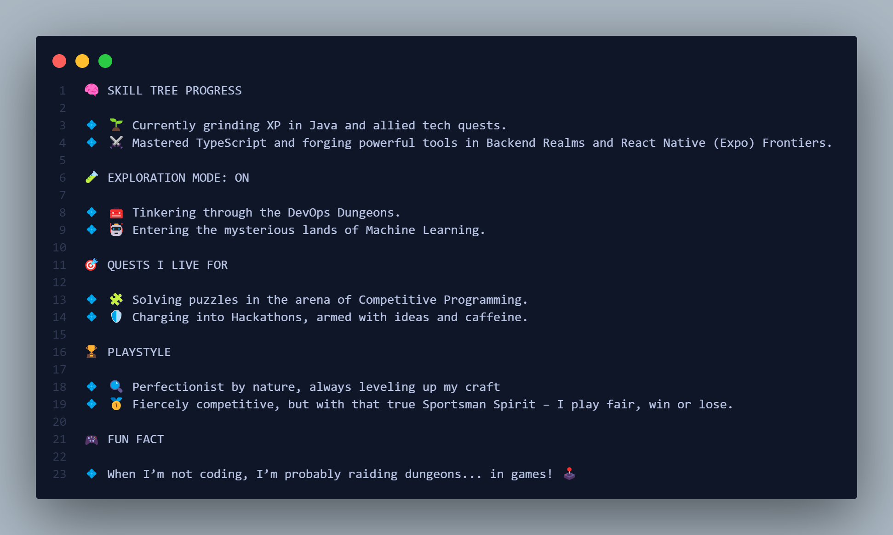

<pre> <h1 align="center">🕹️ Now Loading: Shreeyash.exe</h1>  </pre>

  

<h3 align="center">🌐 <b>Socials</b></h3>

  
  
  

---

<h3 align="center">⚙️ <b>Languages & Scripting</b></h3>

  
  
  
  
  
  
  
  
  

---

<h3 align="center">🌐 <b>Frontend & Mobile Development</b></h3>

  
  
  
  
  
  
  
  
  
  

---

<h3 align="center">🔧 <b>Backend & DevOps</b></h3>

  
  
  
  
  
  
  
  
  
  
  
  

---

<h3 align="center">🗄️ <b>Databases & Cloud</b></h3>

  
  
  
  
  
  
  
  
  
  
  
  
  

---

<h3 align="center">🧠 <b>AI / ML / Tools</b></h3>

  
  
  
  
  
  
  
  
  
  
  
  
  
  

